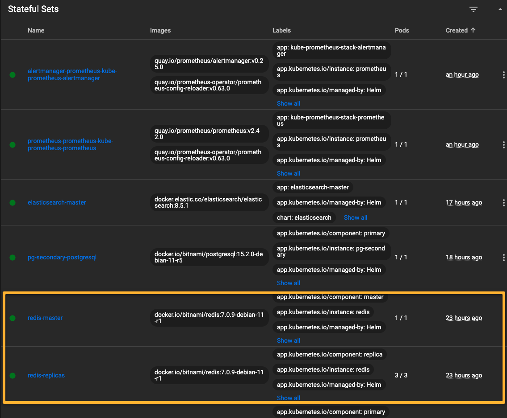
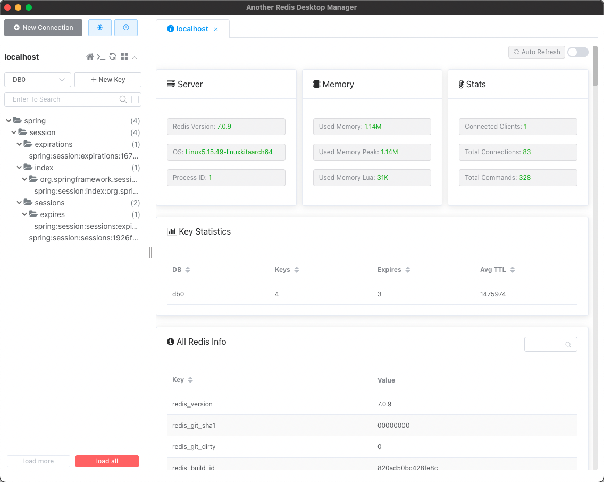

# System Juliet Cache

This project represents Redis distributed caching as run on Kubernetes via Helm, as a part of the overall https://github.com/jvalentino/sys-juliet project. For system details, please see that location.

Prerequisites

- Git
- Helm
- Minikube
- Redis
- Another Redis Desktop Application

All of these you can get in one command using this installation automation (if you are on a Mac): https://github.com/jvalentino/setup-automation

## Stack

Redis

> Redis (Remote Dictionary Server) is an open-source in-memory data structure project implementing a distributed, in-memory key-value database with optional durability. Redis supports different kinds of abstract data structures, such as strings, lists, maps, sets, sorted sets, hyperloglogs, bitmaps, streams and spatial indexes.

https://en.wikipedia.org/wiki/Redis

## Deployment

Prerequisites

- None

To re-install it, forward ports, and then verify it worked, use:

```bash
./deploy.sh
```

...which automatically runs the verification script to forward ports.

### deploy.sh

```bash
#!/bin/sh
# https://github.com/bitnami/charts/tree/main/bitnami/redis/#installing-the-chart
helm repo add bitnami https://charts.bitnami.com/bitnami
helm delete redis --wait || true
helm install redis \
	--wait \
	--set auth.password=redis \
	bitnami/redis
sh -x ./verify.sh
```

### verify.sh

```bash
#!/bin/sh
mkdir build || true
kubectl port-forward --namespace default svc/redis-master 6379:6379 > build/redis.log 2>&1 &
echo AUTH redis | redis-cli > build/output.txt

while [[ ! $(cat build/output.txt) = "OK" ]]; do
    kubectl port-forward --namespace default svc/redis-master 6379:6379 > build/redis.log 2>&1 &
    echo AUTH redis | redis-cli > build/output.txt
    sleep 5
done
```

## Runtime

### Kubernetes Dashboard



### Another Redis Desktop Application



If the BFF is not connected, there will be no data but you can at least connect to it.

Host: localhost

Port: 6379

